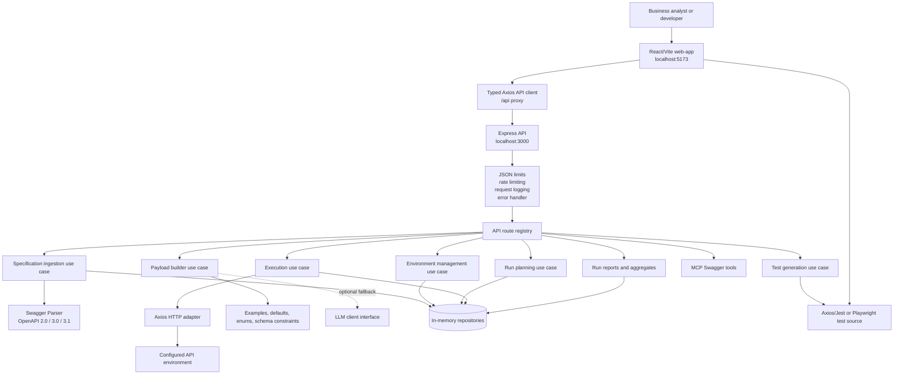

# Swagger AI Agent

Swagger AI Agent is a TypeScript application for importing OpenAPI/Swagger specifications, configuring target environments, planning and executing API tests, generating test code, building request payloads, and reviewing execution reports. It includes an Express backend and a standalone React/Vite frontend.

## Project Status

The backend foundation and implementation phases 1 through 12 are complete. The frontend is implemented as a separate `web-app/` project and currently supports the primary specification, environment, execution, reporting, test-generation, and payload-builder workflows.

Persistence is currently in memory. Restarting the backend clears specifications, environments, run plans, and reports.

## Architecture

The system follows a layered architecture:

- **API layer:** Express routes and HTTP error/status mapping.
- **Application layer:** Use cases for ingestion, environment management, planning, execution, test generation, and payload building.
- **Domain layer:** Framework-independent models, types, repository contracts, and result handling.
- **Infrastructure layer:** Swagger parsing/loading, Axios execution, logging, MCP adapters, LLM adapter contract, and in-memory repositories.
- **Frontend:** React/Vite UI, typed Axios client, Zustand state, responsive workflow screens, and browser-side reporting/export actions.



### Core request flow

1. A specification is imported from JSON/YAML content or a URL.
2. The parser validates and normalizes metadata, servers, operations, parameters, request bodies, responses, security, and tags.
3. A named environment supplies a base URL, headers, authentication, and timeout settings.
4. A run plan selects operations by operation, tag, or full specification and creates test-case definitions.
5. The execution engine builds requests, calls the target API through Axios, asserts expected status codes, and records timing/errors.
6. Reports can be polled, aggregated by tag/method/path, retried for failed cases, and displayed in the frontend.
7. Test-generation and payload-builder use cases produce runnable source and request data without coupling the core domain to a specific LLM or database.

## Backend Features Delivered

### Phases 1-3: Foundation, domain, and infrastructure

- Node.js 20+ TypeScript service using Express.
- Environment-aware configuration and development server.
- Winston-based structured logging.
- Request logging and centralized error handling.
- Health endpoint.
- Framework-independent domain models:
  `NormalizedSpec`, `Operation`, `EnvironmentConfig`, `RunPlan`, `RunReport`, and `TestCaseDefinition`.
- Repository interfaces for specifications, environments, plans, reports, and generated templates.
- Replaceable infrastructure contracts for Swagger loading, parsing, normalization, HTTP calls, MCP, and LLM payload enrichment.
- In-memory repository implementations and adapter contract tests.

### Phase 4: Specification ingestion

- Import OpenAPI/Swagger documents from request content, URL, or file source.
- Support for OpenAPI 2.0, 3.0, and 3.1 metadata and operations.
- Normalization of servers, paths, methods, parameters, request bodies, responses, security, and tags.
- Structural validation fallback for constrained parser runtimes.
- Specification metadata, operation listing, and tag listing.

### Phase 5: Environment management

- Create, list, retrieve, update, and delete named environments.
- Specification-scoped environments.
- Base URL validation.
- Custom headers, authentication configuration, and request timeout support.

### Phase 6: Run planning

- Select one operation, a tag, or the full specification.
- Generate happy-path, validation-error, and authentication-error test definitions where applicable.
- Reject unknown specifications, operations, and tags with controlled errors.
- Persist run plans through repository interfaces.

### Phase 7: Execution engine

- Execute planned operations through an injectable Axios adapter.
- Build path, query, header, authentication, and body values.
- Apply configured timeouts and expected-status assertions.
- Record request duration, response status, failures, network errors, and report details.
- Support synchronous and asynchronous execution responses.

### Phase 8: Test generation

- Generate Jest and Axios test source.
- Generate Playwright test source.
- Support operation selection and positive, negative, authentication, and boundary options.
- Preview generated test suites and return generation metadata.

### Phase 9: Payload builder

- Build deterministic payloads from examples, defaults, enums, schema constraints, and hints.
- Detect unresolved required fields.
- Keep optional LLM enrichment behind an interface.
- Return deterministic payloads when the LLM adapter is unavailable and no enrichment is required.

### Phase 10: MCP integration

- Application-backed Swagger tools for listing operations, planning runs, executing operations, and generating Axios tests.
- HTTP endpoints expose the tools consistently with the normal application use cases.

### Phase 11: Retry and reporting

- Retry failed and errored test cases.
- Preserve passed results during retry.
- Track retry history.
- Aggregate results by tag, HTTP method, and path.
- Paginate execution run history.

### Phase 12: Hardening

- Configurable JSON request-size limits.
- In-memory rate limiting with configurable window and request count.
- Bounded Axios retries for idempotent requests and transient failures.
- Structured request and error logging.
- Consistent external error mapping and controlled 4xx/404 responses.
- Regression coverage for limits, errors, retry behavior, repositories, and adapters.
- Interface-driven persistence to support a future database migration.

## API Reference

The backend listens on `http://localhost:3000` by default. The frontend calls these routes through its `/api` proxy.

### Health

- `GET /health`

### Specifications

- `POST /spec/import`
- `POST /spec/validate`
- `GET /spec/:specId`
- `GET /spec/:specId/operations`
- `GET /spec/:specId/tags`

### Environments

- `POST /environment`
- `GET /spec/:specId/environments`
- `GET /environment/:envId`
- `PUT /environment/:envId`
- `DELETE /environment/:envId`

### Execution and reporting

- `POST /execution/plan`
- `POST /execution/run`
- `GET /execution/status/:runId`
- `GET /execution/runs`
- `POST /execution/retry-failed`
- `GET /execution/aggregate/:runId`

### Test generation

- `POST /testgen/generate-axios-tests`
- `POST /testgen/generate-playwright-tests`
- `GET /testgen/spec/:specId/preview`

### Payload builder

- `POST /llm/build-payload`

### MCP Swagger tools

- `POST /mcp/swagger/list-operations`
- `POST /mcp/swagger/plan-run`
- `POST /mcp/swagger/execute-operation`
- `POST /mcp/swagger/generate-axios-tests`

## Frontend

The frontend is an independent Vite application in `web-app/`.

Implemented UI capabilities include:

- Responsive workspace shell with sidebar, breadcrumbs, skip link, mobile navigation, and offline/API status.
- Light, dark, and system themes with local persistence.
- OpenAPI JSON/YAML file import and URL import.
- Current specification summary, operation counts, tags, and operation inspection.
- Environment creation and deletion with base URL validation, authentication, headers, timeout, and connection health checks.
- Run planning and execution by full specification or tag.
- Axios and Playwright execution engine selection.
- Live execution polling through `/execution/status/:runId`.
- Run history pagination.
- Pass/fail summaries, average latency, result details, and aggregates by method, tag, and path.
- Retry-failed action.
- Dashboard metrics and responsive Recharts visualizations.
- Print/PDF browser output and Excel report export.
- Jest/Axios and Playwright test generation.
- Generated-code copy and download actions.
- Typed Axios API modules, Zustand state, loading/error states, and toast notifications.

The primary frontend files are [web-app/src/App.tsx](web-app/src/App.tsx), [web-app/src/WorkflowScreens.tsx](web-app/src/WorkflowScreens.tsx), [web-app/src/lib/api.ts](web-app/src/lib/api.ts), and [web-app/src/stores.ts](web-app/src/stores.ts).

## Repository Layout

```text
.
├── config/                 Environment-specific backend configuration
├── postman/                Master and phase reference collections
├── src/
│   ├── api/routes/         Express route registration
│   ├── application/        Business use cases
│   ├── core/               App, server, config, middleware
│   ├── domain/             Models, types, repository contracts
│   └── infrastructure/     HTTP, LLM, MCP, persistence, Swagger, logging
├── tests/unit/             Backend unit and integration tests
├── web-app/                React/Vite frontend
├── implementation.md       Backend phase implementation record
├── FE Plan.md              Frontend plan and implementation record
├── TESTING_GUIDE.md        Detailed testing instructions
└── ProjectReadme.md        Project reference
```

## Prerequisites

- Node.js 20 or newer
- npm
- Postman for the manual collection workflow
- Internet access when using the Petstore Swagger document or external API targets

## Installation

From the repository root:

```powershell
Set-Location 'D:\GenAI_Tools\Day 22'
npm install
Set-Location web-app
npm install
Set-Location ..
```

## Run Locally

Start the backend in one terminal:

```powershell
Set-Location 'D:\GenAI_Tools\Day 22'
npm run dev
```

The backend starts at `http://localhost:3000`.

Start the frontend in a second terminal:

```powershell
Set-Location 'D:\GenAI_Tools\Day 22\web-app'
npm run dev
```

The frontend starts at `http://localhost:5173` and proxies `/api` requests to the backend.

A direct health check is:

```powershell
Invoke-RestMethod http://localhost:3000/health
```

Expected response shape:

```json
{
  "status": "ok",
  "service": "swagger-ai-agent",
  "environment": "development"
}
```

### Configuration defaults

The default backend configuration is:

- Port: `3000`
- Environment: `development`
- JSON body limit: `1mb`
- Rate limit: `100` requests per `60` seconds
- Axios maximum retries: `2`
- Frontend port: `5173`
- Frontend API proxy target: `http://localhost:3000`

Configuration can be overridden through the existing environment/configuration modules. The frontend also accepts `VITE_API_BASE_URL`; when omitted it uses `/api`.

## Validation

Backend type-check:

```powershell
Set-Location 'D:\GenAI_Tools\Day 22'
npm run build
```

Backend Jest suite:

```powershell
npm test
```

Frontend production build:

```powershell
Set-Location 'D:\GenAI_Tools\Day 22\web-app'
npm run build
```

Frontend test command:

```powershell
npm test
```

The frontend test script is configured for Vitest. At the current implementation point, the browser workflow is the primary frontend validation path and frontend test files remain a follow-up area.

## Postman Workflow

Use these files for the complete manual workflow:

- `postman/swagger-ai-agent.postman_environment.json`
- `postman/swagger-ai-agent.postman_collection.json`

Run the collection folders in this order:

1. Healthcheck
2. Specification
3. Environment
4. Planning
5. Execution
6. Generation
7. Payload Builder
8. MCP
9. Hardening

The collection scripts save `specId`, `serverUrl`, `envId`, and `runId` for subsequent requests. The phase-specific collections remain as historical reference artifacts; the master collection is recommended for normal regression testing.

## Limitations and Follow-up Work

- All repositories are in memory; no data survives a backend restart.
- Git-based Swagger loading is declared but not implemented.
- The default payload-builder LLM client is unconfigured. Deterministic schema-based payload generation remains available.
- Backend authentication middleware is a foundation, not a complete user-authentication system.
- The frontend depends on the current imported specification context and stored run IDs.
- The frontend environment health check expects a `/health` endpoint on the configured target API.
- Specification collection and specification deletion endpoints are not currently exposed.
- Optional future generation includes TypeScript DTOs, Gherkin features, Cucumber steps, and application-generated Postman artifacts.
- Expanded automated frontend accessibility and workflow coverage remains future work.

For detailed phase notes and manual checks, see [implementation.md](implementation.md), [FE Plan.md](FE%20Plan.md), and [TESTING_GUIDE.md](TESTING_GUIDE.md).
